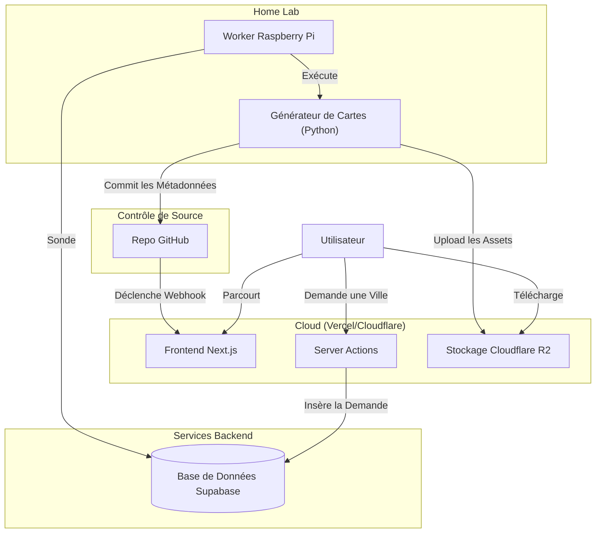

# Document d'Architecture - CityPaper

**Date :** 02/02/2026
**Statut :** Validé
**Auteur :** Architecte Système

## 1. Résumé Exécutif

CityPaper est conçu comme un **Système Hybride Statique/Asynchrone**. La philosophie centrale est de découpler la génération de cartes gourmande en ressources (Python/RPi) de la consommation utilisateur (Web Statique).

L'architecture repose sur :

1.  **Frontend :** Un Site Statique (SSG) haute performance hébergé sur Vercel.
2.  **Stockage :** Cloudflare R2 pour les fichiers lourds (Cartes), Git pour les métadonnées.
3.  **Orchestration :** Supabase pour la file d'attente des demandes et la gestion d'état.
4.  **Worker :** Un Raspberry Pi résidentiel agissant comme moteur de rendu.

## 2. Architecture du Système

### 2.1 Flux de Données (Haut Niveau)

1.  **Parcourir (Lecture) :** Utilisateur -> Vercel CDN -> HTML/JSON Statique -> R2 (Images).
2.  **Demander (Écriture) :** Utilisateur -> Server Action Next.js -> Supabase (File d'attente).
3.  **Générer (Asynchrone) :** Worker RPi -> Poll Supabase -> Génère la Carte -> Upload vers R2 -> Met à jour Git -> Déclenche le Rebuild Vercel.
4.  **Notifier :** Rebuild Vercel -> Nouvelle Ville disponible sur le site.

### 2.2 Diagramme des Composants



## 3. Stack Technique

### 3.1 Frontend

- **Framework :** Next.js 15 (App Router, Server Components).
- **Langage :** TypeScript.
- **Style :** Tailwind CSS 4.0.
- **Bibliothèque UI :** shadcn/ui (Radix Primitives).
- **État :** Zustand (État client minimal).
- **Validation :** Zod.

### 3.2 Backend & Données

- **Base de Données :** Supabase (PostgreSQL) - Offre Gratuite.
  - Utilisé pour : File d'attente des demandes, Statut des demandes, Notifications utilisateurs (futur).
- **Stockage Objet :** Cloudflare R2 - Offre Gratuite (10GB).
  - Utilisé pour : PNGs haute résolution, PDFs, Fonds d'écran.
  - Pourquoi : Pas de frais de sortie (egress fees), compatible S3.
- **CMS :** Basé sur Git (`data/cities.json`).
  - Pourquoi : Garde le site statique et rapide. Le Worker met à jour ce fichier.

### 3.3 Worker (Moteur de Génération)

- **Matériel :** Raspberry Pi 5 (Existant).
- **Runtime :** Python 3.11+.
- **Bibliothèques :**
  - `maptoposter` (Génération coeur).
  - `asyncio` (Concurrence).
  - `boto3` (Interaction R2).
  - `gitpython` (Mises à jour du repo).

## 4. Architecture des Données

### 4.1 Schéma de Base de Données (Supabase)

**Table : `requests`**
| Colonne | Type | Description |
|---------|------|-------------|
| `id` | uuid | Clé Primaire |
| `city_name` | text | Entrée utilisateur |
| `country` | text | Entrée utilisateur |
| `email` | text | Optionnel (pour notification) |
| `status` | enum | `pending`, `processing`, `completed`, `failed` |
| `created_at` | timestamp | |
| `metadata` | jsonb | Stocke les params spécifiques (zoom, style) |

### 4.2 Système de Fichiers (Git)

**Fichier : `data/cities.json`**

```json
[
  {
    "slug": "paris-france",
    "name": "Paris",
    "country": "France",
    "coords": { "lat": 48.85, "lon": 2.35 },
    "assets": {
      "poster_url": "https://r2.citypaper.com/paris-poster.png",
      "wallpaper_url": "https://r2.citypaper.com/paris-wall.jpg"
    },
    "added_at": "2026-02-02"
  }
]
```

## 5. Décisions Clés & Compromis

### 5.1 R2 vs Git LFS

- **Décision :** Utiliser Cloudflare R2.
- **Justification :** Git LFS n'est pas conçu pour héberger des assets statiques pour des sites à fort trafic (limites de bande passante). R2 offre zéro frais de sortie, ce qui est parfait pour les téléchargements gratuits.

### 5.2 Supabase vs Notion

- **Décision :** Utiliser Supabase.
- **Justification :** Bien que Notion soit facile, Supabase fournit un backend SQL robuste, de meilleures limites d'API, et une intégration plus facile avec Next.js (Server Actions) et Python. Il s'adapte aussi mieux pour les fonctionnalités de "Suivi".

### 5.3 Génération Statique (SSG) vs SSR

- **Décision :** SSG (Static Site Generation).
- **Justification :** Le contenu (villes) change peu fréquemment (quotidiennement). Le SSG offre la meilleure performance (NF-01) et le coût le plus bas (NF-02). Le temps de build est négligeable.

## 6. Sécurité & Scalabilité

- **Sécurité API :** Supabase RLS (Row Level Security) pour permettre les insertions publiques mais restreindre les mises à jour/lectures au Worker/Admin.
- **Sécurité Worker :** Le RPi sonde vers l'extérieur (outbound) ; aucun port entrant ouvert.
- **Scalabilité :** Le RPi est le goulot d'étranglement. Si la demande explose, la logique du Worker peut être déplacée vers un conteneur cloud (Docker) sans changer l'architecture.

## 7. Prochaines Étapes

1.  **Initialiser le Projet Next.js** (Structure avec shadcn/ui).
2.  **Configurer le Projet Supabase** (Créer la table `requests`).
3.  **Prototyper le Script Worker** (Connecter le RPi à Supabase).
